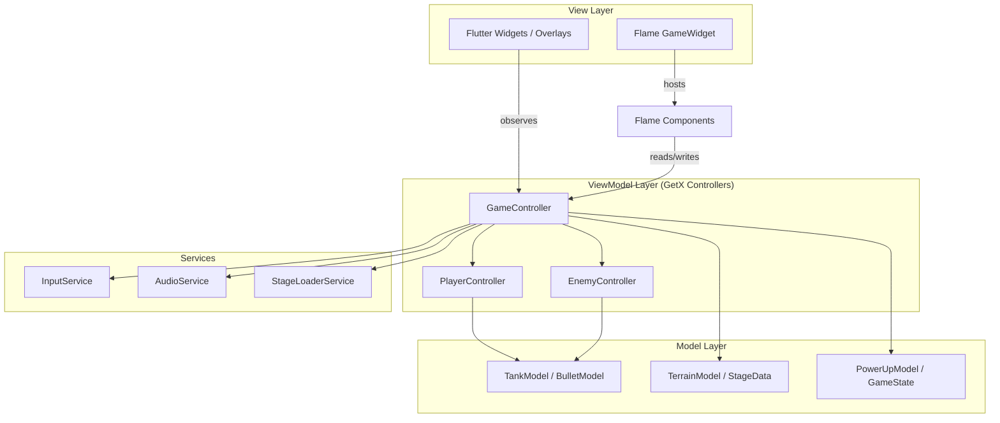

# Battle City 1990 — Flutter Web Clone

Recreate the classic NES *Battle City* as a Flutter Web game using **Flame 1.37** for rendering/physics and **GetX** for reactive state management, following an MVVM architecture.

## Architecture Overview



**Key integration:** Flame's `FlameGame` holds all game components (tanks, bullets, terrain). Each component reads from / writes to GetX controllers. Flutter overlay widgets (HUD, menus) observe GetX `Rx` variables for reactive updates. This avoids tight coupling — the game loop drives physics while GetX drives UI reactivity.

---

## Proposed Changes

### Project Scaffold

#### [NEW] [pubspec.yaml](file:///c:/Users/procint/Desktop/AntiGravity%20Projects/battle_city/pubspec.yaml)

Flutter project with dependencies:
- `flame: ^1.37.0`
- `get: ^4.6.6`
- `flame_audio: ^2.10.6` (optional, for retro SFX)

Include the pixel-art font **Press Start 2P** via Google Fonts or bundled asset.

#### Folder structure

```
battle_city/
├── lib/
│   ├── main.dart
│   ├── model/
│   │   ├── tank_model.dart          # Tank data (type, position, direction, tier)
│   │   ├── bullet_model.dart        # Bullet data (owner, speed, power)
│   │   ├── terrain_model.dart       # Tile enum & terrain grid
│   │   ├── power_up_model.dart      # Power-up types & effects
│   │   └── game_state.dart          # Score, lives, stage number
│   ├── view/
│   │   ├── main_menu_view.dart      # Retro start screen
│   │   ├── game_view.dart           # GameWidget + HUD overlay
│   │   ├── stage_intro_view.dart    # "STAGE N" splash
│   │   └── game_over_view.dart      # Game over / victory
│   ├── viewmodel/
│   │   ├── game_controller.dart     # Master orchestrator
│   │   ├── player_controller.dart   # Player state, upgrades, lives
│   │   └── enemy_controller.dart    # Enemy AI, spawn logic
│   ├── services/
│   │   ├── input_service.dart       # Keyboard mapping (P1 WASD+Space, P2 Arrows+Enter)
│   │   ├── audio_service.dart       # SFX placeholders
│   │   └── stage_loader_service.dart # Load 35 stage maps
│   ├── widgets/
│   │   ├── hud_widget.dart          # Lives, score, enemy count
│   │   ├── retro_button.dart        # Styled menu buttons
│   │   └── pixel_text.dart          # Press Start 2P text widget
│   └── game/
│       ├── battle_city_game.dart     # FlameGame subclass
│       ├── components/
│       │   ├── tank_component.dart   # Flame PositionComponent for tanks
│       │   ├── bullet_component.dart # Bullet movement & collision
│       │   ├── terrain_component.dart# Tile rendering & destruction
│       │   ├── power_up_component.dart
│       │   ├── base_component.dart   # Eagle/base to protect
│       │   └── explosion_component.dart
│       └── stages/
│           └── stage_data.dart       # 35 stage grid definitions
├── web/
│   └── index.html
├── assets/
│   └── fonts/
│       └── PressStart2P-Regular.ttf
└── pubspec.yaml
```

---

### Models

#### [NEW] [tank_model.dart](file:///c:/Users/procint/Desktop/AntiGravity%20Projects/battle_city/lib/model/tank_model.dart)
- `TankType` enum: `player1, player2, basicEnemy, fastEnemy, powerEnemy, armorEnemy`
- `Direction` enum: `up, down, left, right`
- `TankModel` class: position, direction, tier (0-3), speed, isShielded, isAlive

#### [NEW] [bullet_model.dart](file:///c:/Users/procint/Desktop/AntiGravity%20Projects/battle_city/lib/model/bullet_model.dart)
- Owner reference, speed, canDestroySteel (tier ≥ 3), position, direction

#### [NEW] [terrain_model.dart](file:///c:/Users/procint/Desktop/AntiGravity%20Projects/battle_city/lib/model/terrain_model.dart)
- `TileType` enum: `empty, brick, steel, water, ice, forest, base`
- Each brick tile has 4 sub-quadrants for partial destruction

#### [NEW] [power_up_model.dart](file:///c:/Users/procint/Desktop/AntiGravity%20Projects/battle_city/lib/model/power_up_model.dart)
- `PowerUpType` enum: `star, helmet, clock, shovel, grenade, extraLife`

#### [NEW] [game_state.dart](file:///c:/Users/procint/Desktop/AntiGravity%20Projects/battle_city/lib/model/game_state.dart)
- Stage number, scores per player, remaining lives, enemies remaining (out of 20)

---

### Game Engine (Flame Components)

#### [NEW] [battle_city_game.dart](file:///c:/Users/procint/Desktop/AntiGravity%20Projects/battle_city/lib/game/battle_city_game.dart)
- Extends `FlameGame` with `HasKeyboardHandlerComponents, HasCollisionDetection`
- 13×13 logical grid scaled to screen; each cell = 48px
- Manages component lifecycle, references GetX controllers via `Get.find()`

#### [NEW] [tank_component.dart](file:///c:/Users/procint/Desktop/AntiGravity%20Projects/battle_city/lib/game/components/tank_component.dart)
- Renders pixel-art tank using `RectangleComponent` sub-parts with NES color palette
- Handles movement per frame (`update(dt)`), grid-aligned snapping
- Collision detection with terrain and other tanks
- Ice terrain → reduced friction / drift

#### [NEW] [bullet_component.dart](file:///c:/Users/procint/Desktop/AntiGravity%20Projects/battle_city/lib/game/components/bullet_component.dart)
- Moves in straight line at bullet speed, checks collisions
- On brick hit → destroy brick quadrant(s)
- On steel hit → bounce/destroy only if tier ≥ 3
- On tank hit → damage tank, spawn explosion
- Player bullets cancel each other on contact

#### [NEW] [terrain_component.dart](file:///c:/Users/procint/Desktop/AntiGravity%20Projects/battle_city/lib/game/components/terrain_component.dart)
- Each tile = 48×48, subdivided into four 24×24 quadrants for bricks
- Brick destruction removes individual quadrants
- Steel renders with metallic highlight colors
- Water uses animated blue pattern, blocks tank movement
- Forest renders on top layer (above tanks, below UI)
- Ice has distinct color, applies slip physics to tanks on it

#### [NEW] [power_up_component.dart](file:///c:/Users/procint/Desktop/AntiGravity%20Projects/battle_city/lib/game/components/power_up_component.dart)
- Flashing sprite, despawns after timeout, collected on tank contact

#### [NEW] [base_component.dart](file:///c:/Users/procint/Desktop/AntiGravity%20Projects/battle_city/lib/game/components/base_component.dart)
- Eagle icon at bottom-center; if hit → game over

#### [NEW] [explosion_component.dart](file:///c:/Users/procint/Desktop/AntiGravity%20Projects/battle_city/lib/game/components/explosion_component.dart)
- Animated expanding pixel explosion, self-removes after animation

---

### ViewModels (GetX Controllers)

#### [NEW] [game_controller.dart](file:///c:/Users/procint/Desktop/AntiGravity%20Projects/battle_city/lib/viewmodel/game_controller.dart)
- `Rx<GameState>` — reactive game state
- Orchestrates stage loading, game over checks, score tallying
- Manages pause/resume, stage transitions

#### [NEW] [player_controller.dart](file:///c:/Users/procint/Desktop/AntiGravity%20Projects/battle_city/lib/viewmodel/player_controller.dart)
- `Rx<TankModel>` for P1 and P2
- Tracks upgrades (star count), shield timer, respawn logic
- Exposes `move()`, `shoot()`, `collectPowerUp()` methods

#### [NEW] [enemy_controller.dart](file:///c:/Users/procint/Desktop/AntiGravity%20Projects/battle_city/lib/viewmodel/enemy_controller.dart)
- Spawns enemies from 3 spawn points (top-left, top-center, top-right)
- Max 4 enemies on screen; 20 total per stage
- Enemies 4th, 11th, 18th are flashing (drop power-ups)
- Basic AI: random direction changes, bias toward base

---

### Services

#### [NEW] [input_service.dart](file:///c:/Users/procint/Desktop/AntiGravity%20Projects/battle_city/lib/services/input_service.dart)
- Player 1: `W/A/S/D` + `Space` to shoot
- Player 2: `Arrow keys` + `Enter` to shoot
- Processes simultaneous key presses for both players

#### [NEW] [audio_service.dart](file:///c:/Users/procint/Desktop/AntiGravity%20Projects/battle_city/lib/services/audio_service.dart)
- Placeholder methods for shoot, explosion, power-up, game-over sounds

#### [NEW] [stage_loader_service.dart](file:///c:/Users/procint/Desktop/AntiGravity%20Projects/battle_city/lib/services/stage_loader_service.dart)
- Hardcoded 35-stage grid data (13×13 int arrays)
- Returns `List<List<TileType>>` for a given stage number

---

### Views & Widgets

#### [NEW] [main_menu_view.dart](file:///c:/Users/procint/Desktop/AntiGravity%20Projects/battle_city/lib/view/main_menu_view.dart)
- Black background, pixelated title "BATTLE CITY", animated tank sprites
- Options: 1 PLAYER, 2 PLAYERS — flashing selector arrow

#### [NEW] [game_view.dart](file:///c:/Users/procint/Desktop/AntiGravity%20Projects/battle_city/lib/view/game_view.dart)
- `GameWidget` wrapped with HUD overlay using `Obx()` for reactive updates
- Gray sidebar showing enemy icons remaining, player lives, stage number

#### [NEW] [hud_widget.dart](file:///c:/Users/procint/Desktop/AntiGravity%20Projects/battle_city/lib/widgets/hud_widget.dart)
- Right sidebar: enemy tank icons (20 small icons depleting), P1/P2 lives, stage flag

#### [NEW] [pixel_text.dart](file:///c:/Users/procint/Desktop/AntiGravity%20Projects/battle_city/lib/widgets/pixel_text.dart)
- Reusable widget using Press Start 2P font with configurable size/color

---

### Stages Data

#### [NEW] [stage_data.dart](file:///c:/Users/procint/Desktop/AntiGravity%20Projects/battle_city/lib/game/stages/stage_data.dart)
- First 5 stages faithfully recreated from the NES original
- Remaining 30 stages with varied procedural layouts
- Each stage is a `List<List<int>>` (13×13), mapped to `TileType`

---

## User Review Required

> [!IMPORTANT]
> **Flame version:** The plan uses `flame: ^1.37.0`. If `1.37.0` is not yet available on pub.dev, the latest available 1.x version will be used instead. Please confirm if a specific version is required.

> [!IMPORTANT]
> **Sprite assets vs. procedural rendering:** To keep the project self-contained (no external sprite sheets needed), all tanks, terrain, and effects will be drawn procedurally using Flame's shape primitives with an NES-accurate color palette. If you'd prefer sprite-sheet-based rendering, let me know and I'll adjust the plan.

> [!IMPORTANT]
> **Audio:** Sound effects will be placeholder stubs. If you have `.wav`/`.mp3` retro sound files you'd like integrated, please provide them.

---

## Verification Plan

### Automated Tests

Since this is a brand new project, we'll create tests alongside the implementation:

1. **Unit tests for models** — verify tank tier upgrades, bullet power, terrain destruction quadrants:
   ```
   cd c:\Users\procint\Desktop\AntiGravity Projects\battle_city
   flutter test test/model/
   ```

2. **Unit tests for ViewModels** — verify enemy spawn count, power-up collection, game-over detection:
   ```
   flutter test test/viewmodel/
   ```

### Browser Verification

3. **Run the game in Chrome** and visually verify:
   ```
   cd c:\Users\procint\Desktop\AntiGravity Projects\battle_city
   flutter run -d chrome --web-port=8080
   ```
   - Main menu renders with retro styling
   - Game starts and renders 13×13 grid
   - Player 1 (WASD+Space) can move and shoot
   - Player 2 (Arrows+Enter) can move and shoot simultaneously
   - Brick walls break when shot
   - Steel walls block regular bullets
   - Enemies spawn and move toward base
   - Power-ups appear when flashing tanks destroyed
   - Game over triggers when base destroyed or lives depleted

### Manual Verification (User)

4. **Gameplay feel test** — user plays through at least 2 stages to verify:
   - Tank movement feels responsive
   - Two-player controls don't conflict
   - Terrain interactions feel correct (ice sliding, water blocking, forest hiding)
